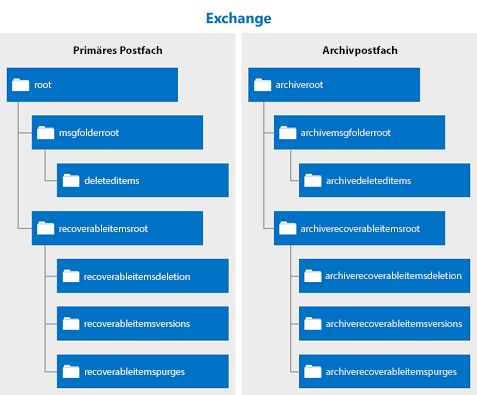

# Löschen von Elementen mithilfe von EWS in Exchange

Finden Sie heraus, wie Sie die von EWS verwaltete API oder EWS in Exchange verwenden können, um Elemente zu löschen, indem Sie sie entweder in den Ordner „Gelöschte Elemente" oder in den Dumpster verschieben.
  
Haben Sie sich schon einmal gefragt, was der Unterschied zwischen dem Verschieben von Elementen in den Ordner "Gelöschte Elemente" und dem Verschieben von Dateien in den Dumpster ist? Möglicherweise möchten Sie mehr über die verschiedenen Optionen des Umgangs mit gelöschten Elementen wissen und wie Sie diese Optionen anwenden können. Exchange-Webdienste (EWS) enthalten drei Optionen des Umgangs mit gelöschten Elementen. In diesem Artikel werden hoffentlich jegliche Unklarheiten über die Unterschiede zwischen diesen Optionen geklärt.
  
## Elemente löschen – Was sind meine Optionen?

Bevor Sie das gesamte Spektrum zum Löschen von Elementen verstehen können, müssen Sie den folgenden Unterschied kennen:
  
- Der Ordner „Gelöschte Elemente” – Wenn Sie Elemente in einem Postfach löschen, ist dies der Ort, an den diese Elemente verschoben werden.
    
- Der Dumpster (auch bekannt als „Wiederherstellbare Elemente") – Wenn Sie Ordner aus einem Postfach löschen, ist dies der Ort, an den diese Elemente verschoben werden.
    
Die Schaubilder 1 und 2 zeigen den Löschvorgang für Elemente und Ordner in einem Postfach. 

**Abbildung 1. Löschen von Elementen aus einem Postfach**

 

**Abbildung 2. Löschen von Ordnern aus einem Postfach**

   
Sie können Elemente und Ordner auf drei verschiedene Arten löschen, je nachdem, wie endgültig das Element oder der Ordner gelöscht werden soll.
  
**Tabelle 1: Optionen für das Löschen von Elementen mithilfe von EWS**

|**Option**|**Aktion**|
|:-----|:-----|
|In den Ordner „Gelöschte Elemente” verschieben    |Dies ist die am wenigsten endgültige Methode, Elemente zu löschen.  Stellen Sie sich vor, Sie werfen ein Blatt Papier in den Papierkorb bei Ihrem Schreibtisch. Das können Sie jederzeit wieder an sich nehmen, wenn Sie es doch noch brauchen.  Sie können jeglichen [Löschvorgang](deleting-items-by-using-ews-in-exchange.md#bk_howdoIdeleteitems) ausführen, der das Element in den Ordner „Gelöschte Elemente“ verschiebt, um diese Aktion auszuführen.  Sie können genauso den [Vorgang „Element verschieben“](http://msdn.microsoft.com/library/dcf40fa7-7796-4a5c-bf5b-7a509a18d208%28Office.15%29.aspx) ( [Item.Move()](http://msdn.microsoft.com/de-DE/library/microsoft.exchange.webservices.data.item.move%28v=exchg.80%29.aspx)) oder den [Vorgang „Ordner verschieben“](http://msdn.microsoft.com/library/c7233966-6c87-4a14-8156-b1610760176d%28Office.15%29.aspx) ( [Folder.Move()](http://msdn.microsoft.com/de-DE/library/microsoft.exchange.webservices.data.folder.move%28v=exchg.80%29.aspx)) nutzen, um ein Element oder einen Ordner in den Ordner „Gelöschte Elemente" zu verschieben.    |
|Vorläufig löschen    |Das Element wird in den Ordner für die gelöschten Elemente im Dumpster verschoben.   Stellen Sie sich vor, Sie leeren Ihren Papierkorb in den Müllcontainer am Straßenrand aus. Sie können noch immer an die Inhalte Ihres Papierkorbs drankommen, ist es nur etwas schwieriger geworden.    Weitere Informationen zum Dumpster (auch als Ordner „Wiederherstellbare Elemente" bezeichnet) und zu Szenarios wie eDiscovery oder Beweissicherungsverfahren finden Sie im Thema [Ordner „Wiederherstellbare Elemente"](http://technet.microsoft.com/de-DE/library/ee364755%28v=exchg.150%29.aspx) auf TechNet.  Vorläufige Löschvorgänge sind nicht für Apps geeignet, die auf Exchange 2007 abzielen. In Exchange 2007 werden vorläufige Löschvorgänge so behandelt, dass ein Bit auf das Element gesetzt wird, um herauszustellen, dass es zu einem unbestimmten Zeitpunkt in den Dumpster verschoben wird.  Vorläufige Löschungen oder Suchen nach Elementen, die vorläufig gelöscht wurden, mithilfe der [Aktion „Element finden“, werden in Exchange Online, Exchange Online als Teil von Office 365 und ab Exchange 2010 nicht unterstützt.    **HINWEIS**: Ordner können nicht vorläufig gelöscht werden.           |
|Endgültig löschen    |Das Element oder der Ordner wird endgültig gelöscht.  Endgültig gelöschte Elemente befinden sich im Ordner für die endgültig gelöschten Elemente des Dumpsters. Stellen Sie sich vor, der Müllcontainer am Straßenrand wird von der Müllabfuhr geleert. Auf die Elemente kann nicht über einen E-Mail-Client wie Outlook oder Outlook Web App zugegriffen werden und wenn für das Postfach keine spezifische Aufbewahrungsdauer festgelegt ist, werden die Elemente nach Ablauf eines festgelegten Zeitraums endgültig gelöscht.  Weitere Informationen zur Aufbewahrungsdauer für Elemente finden Sie im Artikel [Konfigurieren der Aufbewahrungszeit für gelöschte Elemente und Kontingente für wiederherstellbare Elemente](http://technet.microsoft.com/de-DE/library/ee364752%28v=exchg.150%29.aspx).  **HINWEIS**: Ordner werden nicht in den Ordner für endgültig gelöschte Elemente verschoben, wenn sie gelöscht werden. Endgültig gelöschte Ordner werden aus dem Postfach entfernt.  |
   
Das Verschieben in den Ordner „Gelöschte Elemente" und die Möglichkeiten, Elemente endgültig zu löschen, sind transaktional. Dies bedeutet, dass zu dem Zeitpunkt, an dem der Webdienstaufruf abgeschlossen wird, das Element in den Ordner „Gelöschte Elemente" oder in den Dumpster verschoben wurde.
  
Damit Sie die Funktionsweise der Ordner, die gelöschte Elemente aufbewahren, besser verstehen, zeigt die folgende Abbildung die Hierarchie der Ordner, die gelöschte Elemente enthalten können. Die Namen der Ordner, wie sie im Schematyp **DistinguishedFolderIdNameType** oder in der Aufzählung **WellKnownFolderName** in der von EWS verwalteten API angegeben sind. 
  
**Abbildung 3. Hierarchie der Ordner, die gelöschte Elemente enthalten**

  
**Tabelle 2: Ordner, die gelöschte Elemente enthalten**

|**Ordnername**|**Eingeführt in**|**Beschreibung**|
|:-----|:-----|:-----|
|deleteditems    |Exchange 2007    |Der Standardordner „Gelöschte Elemente". Elemente verbleiben in diesem Ordner, bis sie vorläufig oder endgültig gelöscht werden oder ein Aufbewahrungszeitraum abgelaufen ist. Dann werden sie in einen Ordner im Dumpster verschoben. Gelöschte Ordner werden in den Ordner „Gelöschte Elemente" verschoben, und wenn sie vorübergehend oder endgültig gelöscht werden, werden sie dauerhaft aus dem Postfach entfernt und können nicht mehr wiederhergestellt werden.    |
|recoverableitemsroot    |Exchange 2010    |Der Stammordner des Dumpsters bzw. des Ordners „Wiederherstellbare Elemente“. Zugriff auf den Dumpster wurde in EWS in Exchange 2010 eingeführt. Der Anzeigename dieses Ordners lautet „Wiederherstellbare Elemente".    |
|recoverableitemsdeletions    |Exchange 2010    |Der primäre Dumpsterordner für ein Postfach. Vorübergehend gelöschte Elemente und Elemente, die durch eine Aufbewahrungsrichtlinie aus dem Ordner „Gelöschte Elemente" verschoben wurden, werden in diesem Ordner gespeichert. Der Anzeigename dieses Ordners lautet „Gelöschte Elemente“.    |
|recoverableitemsversions    |Exchange 2010    |Hier werden ältere Versionen eines Elements gespeichert. Alte Versionen eines Elements werden erstellt, wenn ein Element aktualisiert wird. Versionen von Entwurfselementen werden nicht in diesem Ordner gespeichert. Der Anzeigename dieses Ordners lautet „Versionen“.    |
|recoverableitemspurges    |Exchange 2010    |Hier befinden sich Elemente, die aus dem Ordner „Gelöschte Elemente“ entfernt wurden. Alle endgültig gelöschten Elemente werden in diesen Ordner verschoben. Der Anzeigename dieses Ordners lautet „Endgültig gelöschte Elemente“.    |
|archiveddeletedtitems    |Exchange 2010    |Der Standardordner „Gelöschte Elemente“ für ein Archivpostfach.    |
|archiverecoverablesitemsroot    |Exchange 2010    |Der Dumpsterstammordner für ein Archivpostfach. Archivierte Elemente, die vorübergehend gelöscht wurden, werden in einen Unterordner in diesem Ordner verschoben.    |
|archiverecoverableitemsdeletions    |Exchange 2010    |Der primäre Dumpsterordner für ein Archivpostfach. Archivierte Elemente, die in den Dumpster verschoben wurden, werden hier abgelegt.    |
|archiverecoverableitemsversions    |Exchange 2010    |Hier werden ältere Versionen von archivierten Elementen gespeichert.    |
|archiverecoverableitemspurges    |Exchange 2010    |Hier werden Elemente gespeichert, die aus dem Archivordner für gelöschte Elemente im Dumpster endgültig gelöscht werden. Alle endgültig gelöschten, archivierten Elemente werden in diesen Ordner verschoben.    |
   
## Wie lösche ich Elemente?

Verwenden Sie eine der folgenden Optionen, um anzugeben, ob ein Element in den Ordner „Gelöschte Elemente” verschoben oder ob es vorläufig bzw. endgültig gelöscht werden soll:
  
- Der einfache Typ **DisposalType**, wenn über EWS auf Exchange zugegriffen wird. 
    
- Die [Aufzählung „DeleteMode”](http://msdn.microsoft.com/de-DE/library/exchange/microsoft.exchange.webservices.data.deletemode%28v=exchg.80%29.aspx), wenn Sie die von EWS verwaltete API verwenden. 
    
Sie können viele verschiedene EWS-Funktionen oder von EWS verwaltete API-Methoden verwenden, um Elemente und Ordner aus einem Postfach zu löschen.
  
**Tabelle 3: EWS-Funktionen und von EWS verwaltete API-Methoden zum Löschen von Elementen **

|**EWS-Funktion**|**Von EWS verwaltete API-Methode**|**Eingeführt in**|**Funktionsweise**|
|:-----|:-----|:-----|:-----|
|[DeleteFolder-Vorgang](http://msdn.microsoft.com/library/b0f92682-4895-4bcf-a4a1-e4c2e8403979%28Office.15%29.aspx)   |[Folder.Delete-Methode](http://msdn.microsoft.com/de-DE/library/exchange/microsoft.exchange.webservices.data.folder.delete%28v=exchg.80%29.aspx)   |Exchange 2007    |Diese Funktion löscht Ordner aus einem Postfach. Mit EWS können Sie direkt mehrere Ordner löschen. Mit der von EWS verwalteten API können Sie nur einen Ordner pro Aufruf löschen.    |
|[DeleteItem-Vorgang](http://msdn.microsoft.com/library/3e26c416-fa12-476e-bfd2-5c1f4bb7b348%28Office.15%29.aspx)   |[Item.Delete-Methode](http://msdn.microsoft.com/de-DE/library/exchange/microsoft.exchange.webservices.data.item.delete%28v=exchg.80%29.aspx)  [ExchangeService.DeleteItems-Methode](http://msdn.microsoft.com/de-DE/library/exchange/microsoft.exchange.webservices.data.exchangeservice.deleteitems%28v=exchg.80%29.aspx)   |Exchange 2007    |Diese Funktion löscht Elemente aus einem Postfach.    |
|[EmptyFolder-Vorgang](http://msdn.microsoft.com/library/98161486-e2f2-480f-8d5d-708ba81b208a%28Office.15%29.aspx)   |[Folder.Empty-Methode](http://msdn.microsoft.com/de-DE/library/exchange/microsoft.exchange.webservices.data.folder.empty%28v=exchg.80%29.aspx)   |Exchange 2010    |Diese Funktion löscht alle Elemente in einem Ordner sowie, wenn gewünscht, auch alle Unterordner in einem Ordner.    |
|[ApplyConversationAction-Vorgang](http://msdn.microsoft.com/library/73d7943d-d361-4f8b-9948-d85f886efa1a%28Office.15%29.aspx)   |[Conversation.EnableAlwaysDeleteItems-Methode](http://msdn.microsoft.com/de-DE/library/exchange/microsoft.exchange.webservices.data.conversation.enablealwaysdeleteitems%28v=exchg.80%29.aspx)  [Conversation.DeleteItems-Methode](http://msdn.microsoft.com/de-DE/library/exchange/microsoft.exchange.webservices.data.conversation.deleteitems%28v=exchg.80%29.aspx)   |Exchange 2010    |Diese Funktion legt das Löschen von E-Mail-Nachrichten in einer Unterhaltung fest, damit diese direkt entfernt werden.    |
|[DeleteUserConfiguration-Vorgang](http://msdn.microsoft.com/library/93e44690-be2d-4fdb-96a8-4ded3c193aed%28Office.15%29.aspx)   |[UserConfiguration.Delete-Methode](http://msdn.microsoft.com/de-DE/library/exchange/microsoft.exchange.webservices.data.userconfiguration.delete%28v=exchg.80%29.aspx)   |Exchange 2010    |Diese Funktion löscht ein Element, das mit einem Ordner verknüpft ist, und verschiebt es in den Dumpster.    |
|[CreateItem-Vorgang](http://msdn.microsoft.com/library/78a52120-f1d0-4ed7-8748-436e554f75b6%28Office.15%29.aspx)   |[Appointment.Accept-Methode](http://msdn.microsoft.com/de-DE/library/microsoft.exchange.webservices.data.appointment.accept%28v=exchg.80%29.aspx)   [Appointment.AcceptTentatively-Methode](http://msdn.microsoft.com/de-DE/library/microsoft.exchange.webservices.data.appointment.accepttentatively%28v=exchg.80%29.aspx)  [Appointment.CancelMeeting-Methode](http://msdn.microsoft.com/de-DE/library/microsoft.exchange.webservices.data.appointment.cancelmeeting%28v=exchg.80%29.aspx)  [Appointment.Decline](http://msdn.microsoft.com/de-DE/library/microsoft.exchange.webservices.data.appointment.decline%28v=exchg.80%29.aspx)  [MeetingRequest.Accept-Methode](http://msdn.microsoft.com/de-DE/library/microsoft.exchange.webservices.data.meetingrequest.accept%28v=exchg.80%29.aspx)  [MeetingRequest.AcceptTentatively-Methode](http://msdn.microsoft.com/de-DE/library/microsoft.exchange.webservices.data.meetingrequest.accepttentatively%28v=exchg.80%29.aspx)  [MeetingRequest.Decline-Methode](http://msdn.microsoft.com/de-DE/library/microsoft.exchange.webservices.data.meetingrequest.decline%28v=exchg.80%29.aspx)   |Exchange 2007    |Hiermit wird ein Element indirekt in den Ordner „Gelöschte Elemente" verschoben, sobald eine Antwort auf eine Besprechungsanfrage gesendet wird oder sobald die Antwort einen bestimmten Termin festgelegt.  Der Löschtyp wird bei diesem Vorgang nicht festgelegt. Die Besprechungsnachrichten werden in den Ordner „Gelöschte Elemente" verschoben, sobald ein Antwortobjekt erfolgreich vom Dienst verarbeitet wurde.    |
   
Sie können Elemente auch mithilfe von Posteingangsregeln in den Ordner „Gelöschte Elemente" verschieben. Sie können beispielsweise [Regeln erstellen](inbox-management-and-ews-in-exchange.md), die eine Löschaktion umfassen. 
  
Einige Dinge müssen Sie beim Löschen von Elementen beachten:
  
- Wenn Sie ein Vorkommen einer Terminserie löschen, wird das Element nicht in den Ordner „Gelöschte Elemente" oder in den Dumpster verschoben. Stattdessen wird das Serienmasterelement der Terminserie aktualisiert.
    
- Sie können keine Standardordner aus dem Postfach löschen. 
    
- Vermeiden Sie das Löschen von Besprechungen oder Besprechungsnachrichten, wie Besprechungsanfragen oder Besprechungsaktualisierungen. Antworten Sie stattdessen auf diese Elemente mit Antwortobjekten. Auf diese Weise werden die zugehörigen Kalenderelemente aktualisiert, um das Verhalten der Antwortenden oder des Veranstalters wiederzugeben.
    
- Der Änderungsschlüssel eines Elements wird nicht aktualisiert, wenn es in einen der Ordner für gelöschte Elemente verschoben wird.
    
- Wenn Sie ein Element endgültig löschen und dann einen [SyncFolderHierarchy-Vorgang](http://msdn.microsoft.com/library/b31916b1-bc6c-4451-a475-b7c5417f752d%28Office.15%29.aspx), eine von EWS verwaltete API-Methode [SyncFolderHierarchy](http://msdn.microsoft.com/de-DE/library/microsoft.exchange.webservices.data.exchangeservice.syncfolderhierarchy%28v=exchg.80%29.aspx), einen [SyncFolderItems-Vorgang](http://msdn.microsoft.com/library/7f0de089-8876-47ec-a871-df118ceae75d%28Office.15%29.aspx) oder eine Methode [SyncFolderItems](http://msdn.microsoft.com/de-DE/library/microsoft.exchange.webservices.data.exchangeservice.syncfolderitems%28v=exchg.80%29.aspx) aufrufen, wird ein Änderungseintrag **Delete** zurückgegeben. Wenn Sie ein Element in den Ordner „Gelöschte Elemente" verschieben, wird ein Änderungseintrag **Update** zurückgegeben. Dies passiert, da das Element oder der Ordner einen neuen [ParentFolderId](http://msdn.microsoft.com/library/258f4b1f-367e-4c7d-9c29-eb775a2398c7%28Office.15%29.aspx)-Eigenschaftswert bekommt. [Lesen Sie mehr über die Synchronisierung](mailbox-synchronization-and-ews-in-exchange.md), falls das Synchronisieren von gelöschten Elementen zu Ihren Tätigkeiten gehört. 
    
## Weitere Informationen zum Löschen von Elementen

- [Pullbenachrichtigungen in Exchange für Postfachereignisse im Zusammenhang mit Löschungen in EWS](pull-notifications-for-ews-deletion-related-mailbox-events-in-exchange.md)
    
- [Umgang mit Fehlern in Exchange im Zusammenhang mit Löschungen in EWS](handling-deletion-related-errors-in-ews-in-exchange.md)
    
## Siehe auch

- [Ordner und Elemente in EWS in Exchange](folders-and-items-in-ews-in-exchange.md)    
- [Entwickeln von Webdienstclients für Exchange](develop-web-service-clients-for-exchange.md)    
- [Ordner „Wiederherstellbare Elemente"](http://technet.microsoft.com/de-DE/library/ee364755.aspx)    
- [Wiederherstellung einzelner Elemente in Exchange Server 2010](http://blogs.technet.com/b/exchange/archive/2009/09/25/3408389.aspx#_Single_Item_Recovery)    
- [Exchange 2013: Terminserie programmgesteuert von Exchange-Servern löschen](http://code.msdn.microsoft.com/exchange/Exchange-2013-Delete-a-e1c7b89d)    
- [Exchange 2013: Aufgaben aus einem Konto auf Exchange-Servern programmgesteuert löschen](http://code.msdn.microsoft.com/exchange/Exchange-2013-Delete-tasks-13824637)    
- [Exchange 2013: Ordner auf Exchange-Servern programmgesteuert leeren](http://code.msdn.microsoft.com/exchange/Exchange-2013-Empty-6487df37)    
- [Exchange 2013: Ordner programmgesteuert von Exchange-Servern löschen](http://code.msdn.microsoft.com/exchange/Exchange-2013-Delete-aa1a5823)    
- [Exchange 2013: Viele Elemente programmgesteuert von Exchange-Servern löschen](http://code.msdn.microsoft.com/exchange/Exchange-2013-Delete-many-064f8760)    
- [Exchange 2013: Kontakte programmgesteuert von Exchange-Servern löschen](http://code.msdn.microsoft.com/exchange/Exchange-2013-Delete-3b8b0640)    
- [Mithilfe von EWS in Exchange Termine löschen und Besprechungen absagen](how-to-delete-appointments-and-cancel-meetings-by-using-ews-in-exchange.md)    
- [Persistente Anwendungseinstellungen mithilfe von EWS in Exchange verwalten](how-to-manage-persistent-application-settings-by-using-ews-in-exchange.md)
    

