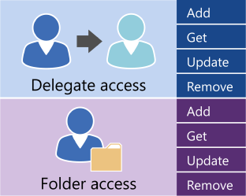

# Verwalten des Benutzerzugriffs in Exchange mithilfe der Exchange-Webdienste

Erfahren Sie, welche Optionen Sie für die Verwaltung des Zugriffs auf Ihren Exchange-Server für den Benutzerkonto haben.
  
Exchange-Webdienste und die verwaltete EWS-API bieten eine beschränkte Anzahl von Vorgängen, die Sie zum Verwalten von Konten auf Exchange Online, Exchange Online im Rahmen von Office 365 oder einer Exchange-Version, die mit Exchange 2013 beginnt, verwenden können. Sie können die in der folgenden Abbildung gezeigten Vorgänge verwenden, um Stellvertretungen zu verwalten und Ordnerzugriffsberechtigungen für andere Konten festzulegen. 
  
**EWS-Vorgänge für Stellvertretungs-und Ordner Zugriff**

  
Wenn Ihre Anwendung zusätzliche Kontrolle über die Konten auf einem Exchange-Server benötigt, können Sie Exchange-Verwaltungsshell-Cmdlets zum Verwalten der Konten verwenden. Sie können die Exchange-Verwaltungsshell-Cmdlets aufrufen, indem Sie einen der folgenden Schritte ausführen:
  
- Schreiben einer Anwendung mithilfe von C# oder Visual Basic, die die Exchange-Verwaltungsshell-Cmdlets aufruft. Sie können sich den Beispielcode in der [Exchange-Verwaltungsshell-API-Dokumentation](../management/exchange-management-shell.md) ansehen, um zu erfahren, wie Sie ein Cmdlet aufrufen. 
    
- Verwenden von Windows PowerShell-und Windows PowerShell-Skripts zum Aufrufen von Exchange-Verwaltungsshell-Cmdlets. Eine vollständige Liste der [Exchange Server PowerShell (Exchange-Verwaltungsshell)](https://docs.microsoft.com/powershell/exchange/exchange-server/exchange-management-shell?view=exchange-ps)finden Sie zusammen mit Beispielen, die zeigen, wie Sie verwendet werden können. 
    
## Siehe auch

- [Einrichten Ihrer EWS-Anwendung](setting-up-your-ews-application.md)   
- [Exchange 2013-Cmdlets](https://docs.microsoft.com/powershell/exchange/?view=exchange-ps)  
    

